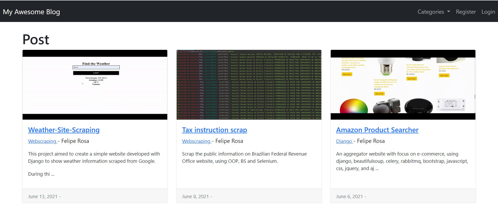
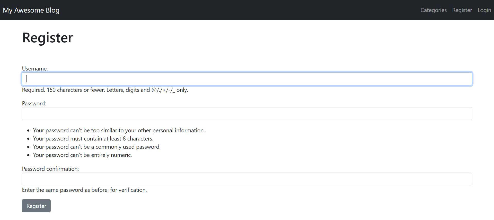
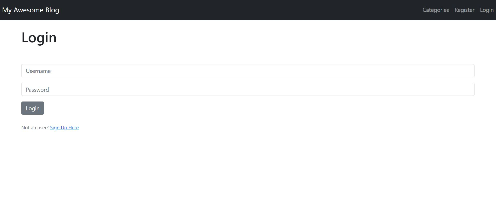
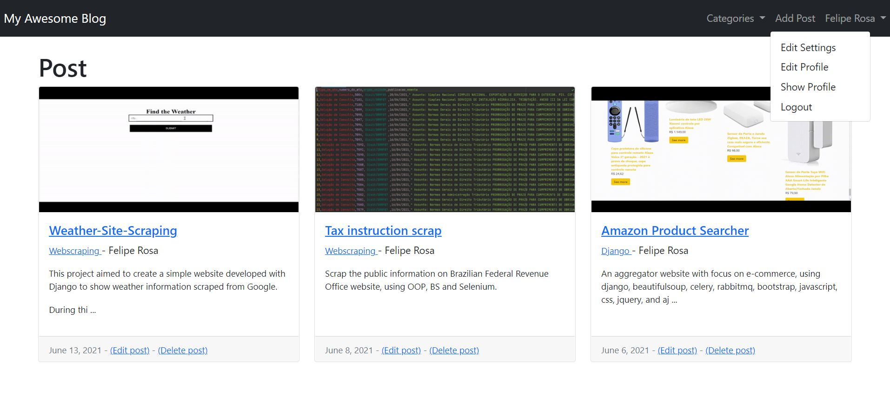
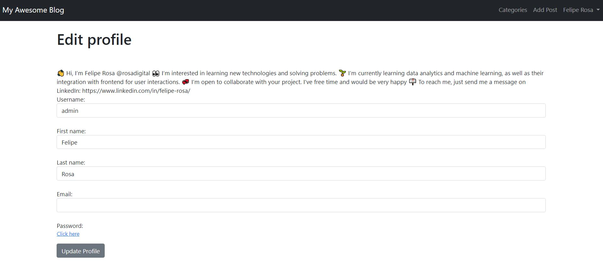
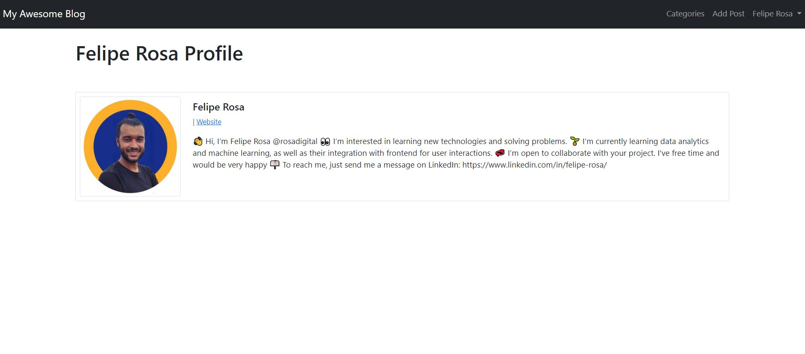
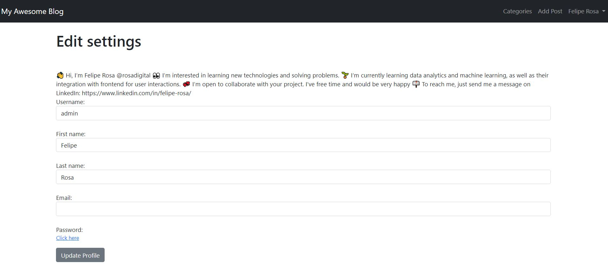
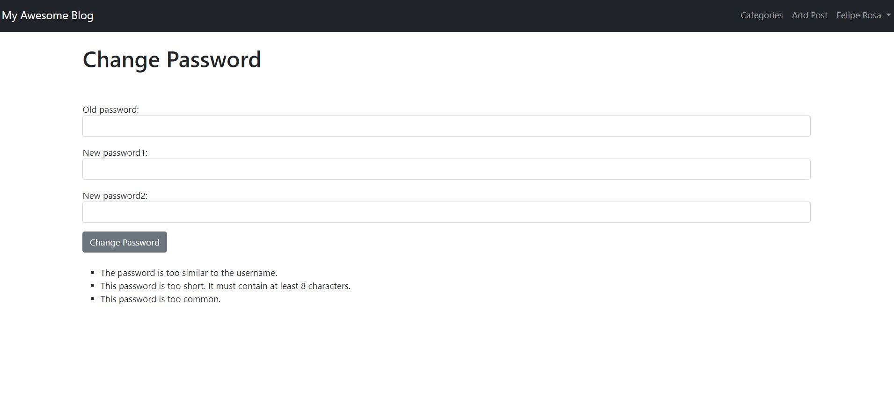
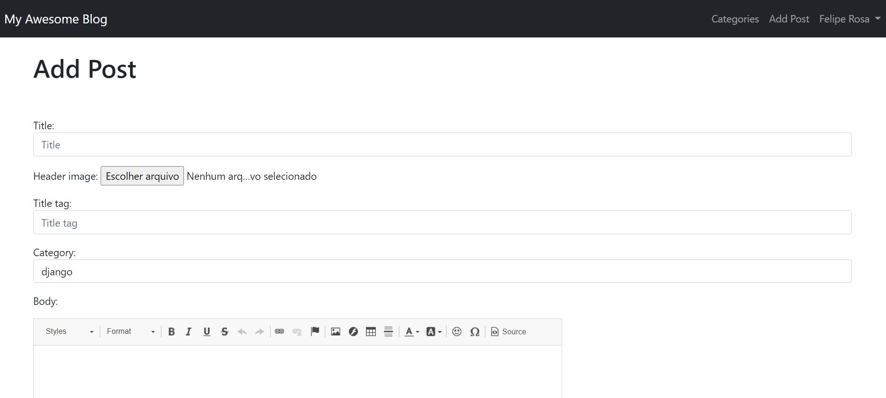

# Simple blog
## 💻 About this project (sobre este projeto)
:us: This project aimed to create a simple blog website to be deployed on Heroku, using AWS-S3 to store static assets (images).

:brazil: Este projeto teve por criar um simples blog para ser implementado no Heroku, utilizando AWS-S# para armazenar arquivos estáticos (imagens).

---
## ⚙️ Project demonstration (demontração do projeto)
A blog is a website with additional dinamic functionalities, such as: logging and logout; sign up; and adding, creating, liking, and commenting posts.

See bellow a live a demonstration:
<p align="center"> 

Now, see bellow some page layouts of this projetc:

- Home
<p align="center"> 

- Sign up
<p align="center"> 

- Login page	
<p align="center"> 

- Logged home
<p align="center"> 

- Edit profile
<p align="center"> 

- Show profile
<p align="center"> 

- Edit settings
<p align="center"> 

- Editing password
<p align="center"> 

- Adding post
<p align="center"> 

	
---
	
## 💡 Knowledge acquired (conhecimentos adquiridos)

- During this project, I learned:
  - Deploy a Django's website on Heroko cloud application using AWS-S3 to store statics files, such as images;
  - Integrate a database with sign up, logging and logout page, as well as with creating and adding post;
  - Use authenticator for loggings, use generic views to rendering (listview, detailview, createview, updateview, and deleteview);
  - Use Django with Bootstrap to create an intuitive user interface, and bootstrapfy forms;
  - Add article snippet; and
  - Create a like and dislike button, as well as a section for comments;
	
---

## 🚀 How to execute this project (como executar este projeto)

 - To run the code it is recommended to use an IDE, such as Pycharm;
  - Just clone this project, and open it on your IDE.
 
 - Before starting anything, it is recommended to run the following commands on your IDE terminal,
  - on info folder:
    - pip install -r requirements.txt (to install required packages);
    - py manage.py migrate core zero (to reset the database);
    - py manage.py makemigrations; and
    - py manage.py migrate.

### 🎲 Requirements (requisitos)

To run the code, it is recommended to install the following Python Packaged:	
- asgiref==3.3.4
- dj-database-url==0.5.0
- dj-static==0.0.6
- Django==3.2.4
- django-heroku==0.3.1
- psycopg2==2.9.1
- python-decouple==3.4
- pytz==2021.1
- sqlparse==0.4.1
- static3==0.7.0
- whitenoise==5.2.0
- django-ckeditor==6.1.0
- Pillow==8.2.0

#### Running the codes (rodando os códigos)

```bash

# Clone this repository
$ git@github.com:rosadigital/Blog-Site-Django.git
# Open the repository on pycharm

```

---

## 🦸 Author (autor)


Felipe Rosa on [LinkedIn](https://www.linkedin.com/in/felipe-rosa/)

---

## 📝 License (licença)

This project is licensed under [MIT](./LICENSE).

Este projeto esta sobe a licença [MIT](./LICENSE).

Made with ❤️ by Felipe Rosa 👋🏽 [Contact here!](https://www.linkedin.com/in/felipe-rosa/)

Feito com ❤️ por Felipe Rosa 👋🏽 [Entre em contato!](https://www.linkedin.com/in/felipe-rosa/)

--
